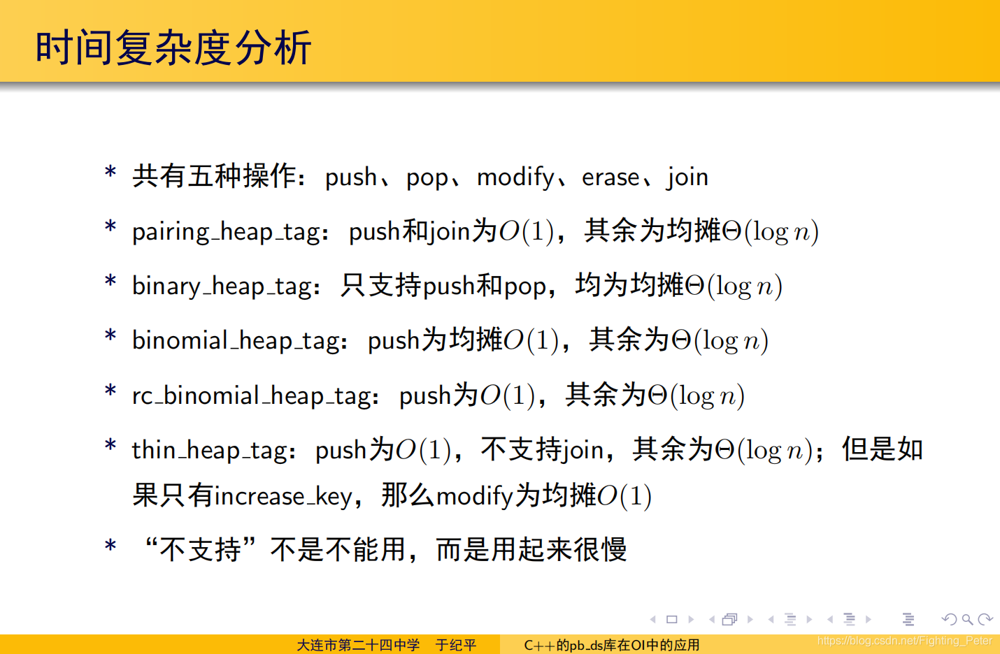
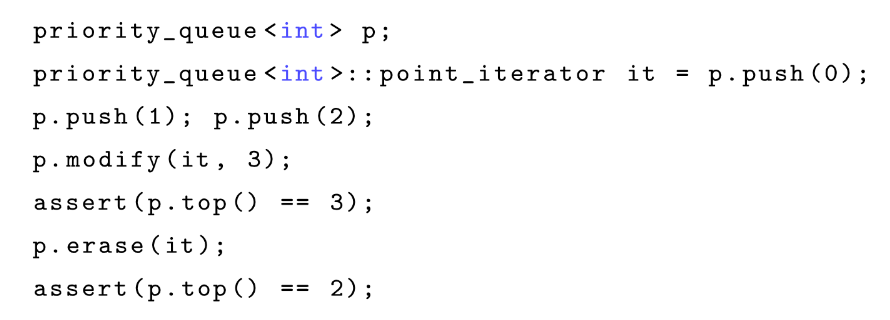
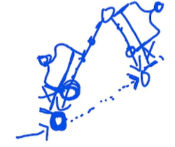
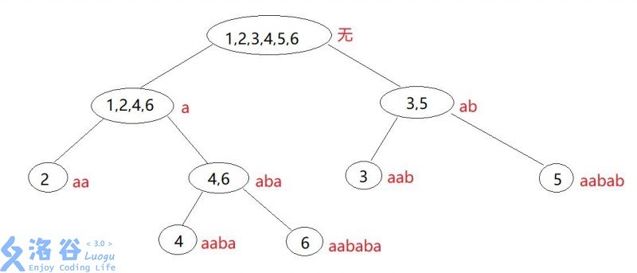
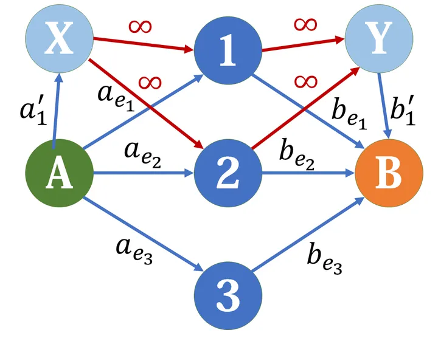

[TOC]

# 数据结构

## 可并堆

### pbds可并堆

提供了5种堆：binary_heap_tag，binomal_heap_tag，pairing_heap_tag，thin_heap_tag，rc_binomal_heap_tag

时间复杂度对比：



modify 和 erase 操作需要记录指针，其实不太好用



比较方便的功能：pbds可并堆可以用迭代器遍历

### 左偏树

左偏树的 $dist$ 为节点到子树中最近一个空儿子的距离，注意与树的深度的区别。

性质： $dist$ 不超过 $\log$ ，考虑满二叉树第 $x$ 层才有空儿子，那么节点个数至少有 $2^{x-1}$ 个。

合并操作类似 FHQ-Treap，时间复杂度 $O(\log n)$

支持删除，删除需要记录在堆里的编号，删除方式是合并左右儿子，然后向上 pushup $dist$，最多只会 pushup $\log$ 层，所以时间复杂度 $O(\log n)$。

注意：如果有删除操作，不方便维护 tag，请使用 标记永久化；也不方便维护 size，得考虑用别的东西维护，比如 dsu

[P3261 [JLOI2015] 城池攻占](https://www.luogu.com.cn/problem/P3261) 这题算是用左偏树比较方便，时空复杂度也都比较低，其他做法像线段树合并空间复杂度就比较高

大多数情况下，左偏树都能用 pbds可并堆 或者其他数据结构替代。

### pbds可并堆与左偏树对比

- 如果需要对整个堆打 tag ，而且 tag 不方便求逆 (比如乘法)，考虑左偏树维护 [P3261 [JLOI2015] 城池攻占](https://www.luogu.com.cn/problem/P3261)；如果方便求逆 (比如加减)，可以考虑 pbds可并堆+标记永久化
- 标记永久化时，需要做合并操作，考虑启发式合并：暴力小的那堆把标记应用上，然后合并到另一堆。如果使用 pbds可并堆，可以用 pairing_heap_tag，合并时直接用迭代器遍历小的那堆，由于它的 push 操作是 $O(1)$ ，所以总时间复杂度是 $O(n \log n)$；如果用左偏树做，也是一样的，先遍历一遍然后再整个合并；而用 set 做启发式合并复杂度就是 $O(n \log^2 n)$ [P3273 [SCOI2011] 棘手的操作](https://www.luogu.com.cn/problem/P3273)


# 字符串

border，周期，循环节

性质 p是周期，q是border q=|S|-p

border 没有单调性：abab  ab是border但b不是

border 传递性：S的border的border也是S的border


## KMP

预处理每个前缀最大border（去掉本身）

势能分析


## hash

多项式hash：将字符串看做 base 进制下的数字串

base>字符集

mod>=base^2

根据生日悖论，mod最好超过检测次数的平方

自然溢出容易构造hash冲突：bzoj 3097

mod应该是质数：选合数相当于选很多小质数，

mod^2 不爆 ll

双模：不泄露模数的前提下，无法构造hash冲突，bzoj 3099 无人ac

多模冲突概率：相乘 P(mod1)*P(mod2) 

应用

快速计算子串hash

二分+hash求LCP


## AC自动机

推广border概念：广义border -> S串的前缀与T串的后缀相等

AC自动机的fail指针：对于trie中每一个点（某个字典串的前缀），它与trie中所有串的最大border。求法原理与kmp求border原理一样，遍历父节点的fail指针，所以要求所有长度小于这个点的适配指针都求好了才能求它，所以用bfs求



复杂度类似KMP的势能分析

trie图：有边直接走，没边走fail


## SAM

right/endpos集合：endpos(t)表示在字符串s中，t的所有结束位置的集合。如下图

字符串s：aababa




后缀自动机构造：[后缀自动机多图详解（代码实现） - maomao9173 - 博客园 (cnblogs.com)](https://www.cnblogs.com/maomao9173/p/10447821.html)

# 图论

## 网络流


## 网络流模型及建图技巧

### 拆点

#### 使用次数拆点

- 如果限制这个点最多被使用 $x$ 次，可以把该点拆成 **入点** 与 **出点**

- **入点** 与 **出点** 连边，流量为次数 $x$

#### 时间拆点


---

### 最小割模型


#### 最大权闭合子图


#### 文理分科模型 (二者取一式问题)

- 定义：将若干元素 $e_1, e_2,…,e_n$ 划分到两个集合 $A$, $B$ 中。对于元素 $e_i$ ，它被划分到 $A$ 或 $B$ 中分别能获得一个 $a_{e_i}$ 或 $b_{e_i}$ 的分值。除此之外，还给出若干个组合 $C_i⊆A$ ，当组合中的元素被同时划分到 $A$ 或 $B$ 时，可以获得额外的分值 $a_i^′$ 或 $b_i^′$ 。求最大的分值。

- 此类问题也是最小割模型之一，建图如下：



- 记非无穷边权和为 $sum$ ，最小割为 $cut$，$ans=sum-cut$

---

### 费用流模型

#### 区间覆盖模型

- 定义：给出一些区间，限制不存在某个点被多于 $k$ 个区间覆盖，要求选出若干个区间，求长度总和最大

- S → 数轴起点 (流量 k，费用 0​)，数轴终点 → T (流量 INF，费用 0)

  i → i+1 (流量 INF，费用0)

  对于每个区间 $[l,r]$ ，$l → r+1$ (流量 1，费用 $r-l+1$)

模板题：[P3358 最长k可重区间集问题](https://www.luogu.com.cn/problem/P3358) 

变形：[P3980 [NOI2008] 志愿者招募](https://www.luogu.com.cn/problem/P3980) 

- 建图：第 $i$ 天的需求为 $a_{i}$，在 $i$ 与 $i+1$ 连一条容量为 $INF-a_{i}$，费用为 $0$ 的边；对于一个志愿者 $(s,t,c)$ ，在 $s$ 和 $t+1$ 间连一条容量为 $INF$，费用为 $c$ 的边。

- 首先我们知道最小费用最大流求的是在流最大的前提下的最下费用，于是我们可以人为定一个最大流，然后花钱来达到这个最大流。对于这题来说，显然最大流就是 $INF$，第 $i$ 与第 $i+1$ 个节点间的边的容量为 $INF-a_{i}$，于是要达到最大流我们就还需要从志愿者的边上补上这 $a_{i}$ 的流量。而一个从 $s$ 工作到 $t$ 的志愿者可以为 $s$ 到 $t$ 之间的任何一个节点补充流量，于是我们就在 $s$ 和 $t+1$ 间连上一条费用为 $c$ 的边，表示每补 $1$ 流量需要花费 $c$ 的代价。

# 数学

## 概率期望

- 期望线性性质：和的期望=期望的和。例题 [P1297 \[国家集训队] 单选错位](https://www.luogu.com.cn/problem/P1297)

- 独立事件，期望是概率的倒数


# 数论

## gcd

- Q：如何理解 gcd(a,b)=gcd(b,a%b)？

  A：a=b\*q+r, r=a%b，设 g=gcd(a,b)，g 肯定是 b 的因数，那么 b\*q%g==0，需要让 g 为 a 的因数，所以 g 一定是 r 的因数

- Q：时间复杂度？

  A：a%b 会让 a 至少减小一半，所以复杂度是 log

## 线性筛

- Q：为什么不用写 ```j<tot``` ?

  A：如果 i 是质数，则当前质数表里肯定有 i；如果 i 是合数，i 肯定是被当前质数表中某个质数筛出来的。所以一定存在 ```i%p[j]==0``` 

## 区间筛

筛区间 [L,R] 中的质数。是埃筛变形。

[L,R] 中的合数必定至少有一个质因子是 <=sqrt(R)，所以先筛 sqrt(R) 内的质数。

然后做埃筛，枚举在区间 [L,R] 中的倍数 

## CRT

```cpp
ll CRT(int n,ll *a,ll *m)
{
	int i;
	ll p,mi,res,invmi;
	p=1;
	res=0;
	for(i=1;i<=n;i++) a[i]=(a[i]%m[i]+m[i])%m[i];
	for(i=1;i<=n;i++) p*=m[i];
	for(i=1;i<=n;i++)
	{
		mi=p/m[i];
		invmi=inv_exgcd(mi,m[i]);
		res=(res+qmul(a[i]*mi,invmi,p))%p;
    }
    return res;
}
```

- Q：为什么求 ```invmi``` 不需要判逆元是否存在？

  A：因为 m 互质，mi 是用 m 的乘积 p 除以 m[i] 得到，所以 mi 一定与 m[i] 互质

- Q：为什么 ```a[i]*mi``` 不用对 p 取模？

  A：因为第一个循环保证了 a[i] 一定是正数且一定小于 m[i] ，p 除以 m[i] 再乘上比 m[i] 小的数，结果一定小于 p

## 扩展欧拉定理（欧拉降幂公式）

$$a^b\equiv\begin{cases}a^b &b<\varphi(m)\\a^{b\bmod\varphi(m)+\varphi(m)} &b\ge\varphi(m)\end{cases}\pmod m$$

证明：不会。

# 解析数论

## 积性函数

积性函数：对于任意互质的整数 $a,b$ 有 $f(ab)=f(a)f(b)$ 则称 $f(x)$ 的数论函数。

完全积性函数：对于任意整数 $a,b$ 有 $f(ab)=f(a)f(b)$ 的数论函数。
- 常见的积性函数：$\varphi,\mu,\sigma,d$
- 常见的完全积性函数：$\epsilon,I,id$

这里特殊解释一下 $\epsilon,I,id$ 分别是什么意思：
$\epsilon(n) = [n=1], I(n) = 1, id(n) = n$


## 狄利克雷卷积

设 $f, g$ 是两个数论函数，它们的狄利克雷卷积卷积是：$(f*g)(n) = \sum \limits _{d | n} f(d) g(\frac{n}{d})$

性质：满足交换律，结合律

单位元：$\epsilon$ （即 $f*\epsilon=f$）

结合狄利克雷卷积得到的几个性质：
1. $\mu * I = \epsilon$
2. $\varphi * I = id$
3. $\mu * id = \varphi$

## 莫比乌斯反演


若 
$$g(n) = \sum\limits_{d|n}f(d)$$

则
$$f(n)=\sum\limits_{d|n}\mu(d)g(\frac{n}{d})$$

证明：这里需要用到前面提到的性质：$\mu * I = \epsilon$

给出的条件等价于 $g=f * I$

所以 $g*\mu=f*I*\mu=f*\epsilon=f$ 即 $g * \mu = f$ 即 结论。


# 组合数学

## 卡特兰数

通项公式：$\binom{2n}{n} - \binom{2n}{n-1}$

常见的递推公式：$C_n=[n=0]+\sum_{j=0}^{n-1} C_j C_{n-j-1}$ , $C_n$ 为 Catalan 数第 $n$ 项，见到这个递推公式需要联想到是 Catalan 数。

经典模型：

- n 个节点的无标号二叉树数目。
- n 个顶点的凸多边形的三角划分数。
- 有一个空栈，进栈序列是 1*,* 2*, . . . ,* n，出栈序列的方案数。即合法栈序列的方案数。
- 从 (0, 0) 沿着格路向右向上走到 (n, n)，始终不高于 y = x 的方案数。
- 圆上 2n 个点，一对一连线，线不相交的方案数 → 转化成合法栈序列的方案数


# dp

## 差值dp

涉及到“二者差”的最优化问题或者计数类问题，可以考虑用差值DP。这类问题的一般暗示会有：谁追上谁，谁减去谁。

差值DP属于DP的一种状态设置方式，就是设置状态的时候，把“差值”这一维加进去

模板题：[P1651 塔](https://www.luogu.com.cn/problem/P1651) 

练习：[P5664 [CSP-S2019] Emiya 家今天的饭](https://www.luogu.com.cn/problem/P5664) 

## 概率dp

初始化考虑哪些状态概率为1

## 树形dp

- 子树合并类型的树上背包复杂度证明

状态形如 $f[x][j]$ 表示 $x$ 子树内选了 $j$ 个，转移形如$f[x][j+k]=∑f[x][j]∗f[y][k]$

假设树上有n个点，第二维限制为k（最多选k个）我们熟知，这样dp复杂度上界是 $n^2$ 的。因为合并大小为a,b的子树复杂度是a*b，可以看成a子树内任选一点，b子树内任选一点进行匹配，不管怎么合并任意两个点只会在其lca匹配一次，所以是 $n^2$ 的。

但是严格分析一下复杂度，可以得到更好的上界：O(nk)

首先，定义大小超过k的子树为大子树，小于k的为小子树。

一个极小的大子树一定是由若干个极大的小子树合并而成的，而且合并的过程中就会从极大的小子树变成极小的大子树。假设所有的极大的小子树的大小分别为x1,x2,x3…..xm，显然x1+x2+…+xm<=n，将这些小子树并入大子树的复杂度为k*(x1+x2+…+xm)<=nk，可以认为是每个极大的小子树被消灭掉所产生的总时间代价不超过nk

考虑一个极大的小子树（大小x<=k）内部合并上来的复杂度，由上面的分析知是x^2的
因此每个小子树内部合并的复杂度就是$x1^2+x2^2+…+xm^2$，xi<=k，显然当尽量多的xi取到k这个值才会更大，因为假设∑xi=n
为定值，x1>x2，如果让x1++,x2–，上面那个值会变大。这样复杂度就是n/k*k^2=nk

最后，考虑将所有的极小大子树合并成整棵树的复杂度，显然极小的大子树互不包含，因此极小的大子树个数不会超过n/k个，而每合并两个的时间开销是$k^2$，因此这部分复杂度是n/k*k^2=nk

综上，复杂度上界为O(nk)

link: [子树合并背包类型的dp的复杂度证明_关于子树合并背包类型的dp的复杂度-CSDN博客](https://blog.csdn.net/lyd_7_29/article/details/79854245)


